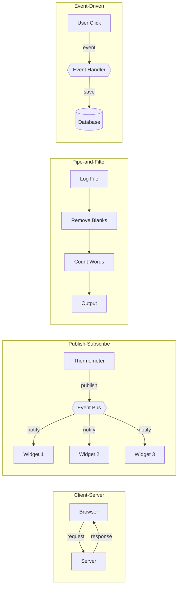
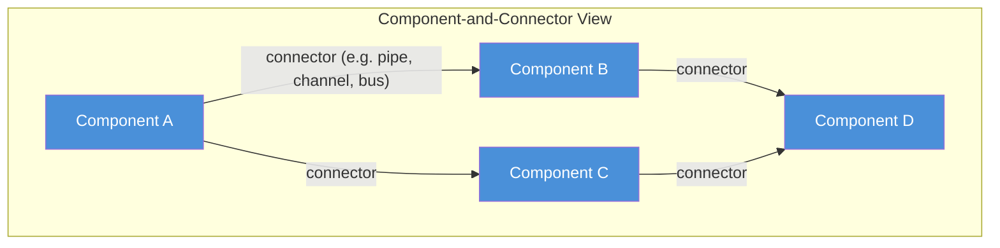
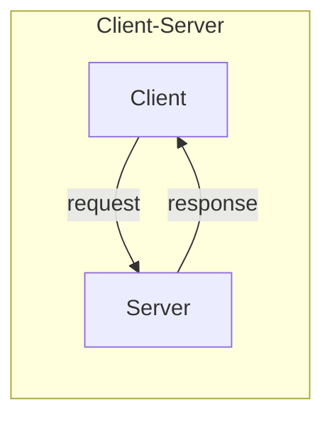
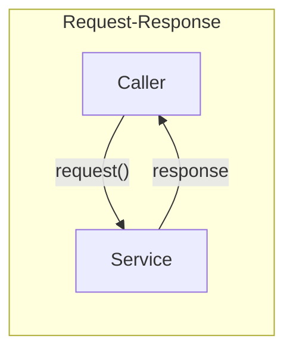
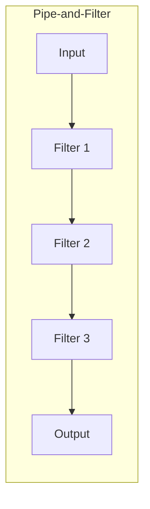
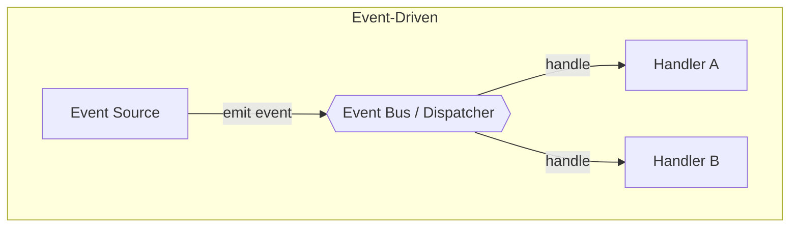
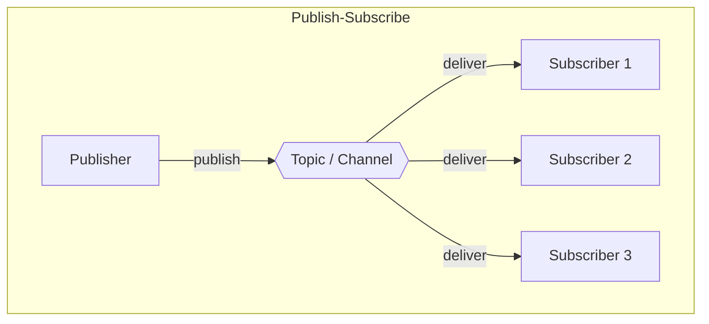
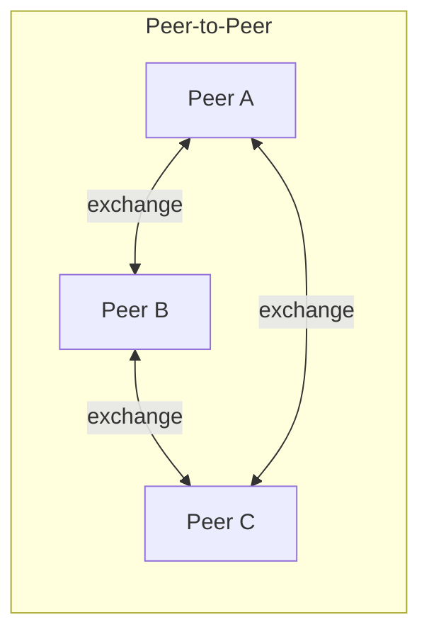

# 01. Runtime Interaction Styles

---

## Introduction

> **Runtime interaction styles** are architectural styles that focus on how the active parts of a system collaborate while the system is running.

In architecture documentation terms, this is closely related to **component-and-connector thinking**: components are principal units of runtime interaction or data storage, while connectors are the mechanisms that let those components interact. 

This makes runtime interaction styles especially useful when the main architectural question is not only _“What parts exist?”_ but also _“How do those parts communicate during execution?”_ (Bass et al., 2021; Clements et al., 2004; Clements et al., 2010).

---

## What Runtime Interaction Means

In simple terms, **runtime interaction** refers to how software components "talk" to each other while the application is actively running. 

**Extremely Short Examples:**
- **Client-Server:** A web browser asks a server for a webpage.
- **Publish-Subscribe:** A thermometer publishes "72°F," and three different dashboard widgets update automatically.
- **Pipe-and-Filter:** A log file is passed through a program that removes blank lines, then into another program that counts the words.
- **Event-Driven:** A user clicks "Submit," triggering an event that saves data to a database.

---

## Alternate Terminology

Depending on the literature or the organization, **runtime interaction styles** may also be referred to as:
- Communication Patterns
- Component-and-Connector Styles
- Messaging Patterns
- Integration Patterns
- Execution Architectures

---

## Why This Category Focuses on Runtime Interaction

A software system can be described through many structures. Some structures are non-runtime, such as module decomposition or organizational allocation. Others are **runtime-related**, where the important relationships are things like “invokes,” “signals,” or “sends data to.” 

Runtime interaction styles belong to this second category because they focus on executing elements and the pathways through which those elements coordinate behavior during operation (Clements et al., 2005; Clements, 2006).

This means runtime interaction styles are **different** from code organization strategies or deployment styles:
- **Package-by-feature**, for example, is about how source code is arranged. 
- **Monolith versus microservices** is primarily about system composition and deployment boundaries. 

Runtime interaction styles instead ask questions such as: 
- _Who initiates communication?_ 
- _Is communication synchronous or asynchronous?_ 
- _Is data pushed, pulled, streamed, broadcast, or routed through intermediaries?_ 

Those interaction choices often affect performance, modifiability, scalability, observability, and fault behavior (Bass et al., 2021; Kazman et al., 2000).

---

## Runtime Interaction Styles and Component-and-Connector Views

Runtime interaction styles are especially natural to express through **component-and-connector views**. In these views, the architect represents runtime components, the connectors that link them, the interfaces through which they interact, and the overall graph of communication paths in the system. Common examples of connector pathways include **pipes**, **publish-subscribe buses**, and **client-server channels** (Clements et al., 2004).

This matters because many important runtime questions are really **connector questions**: 
- How is data transported? 
- Who knows about whom? 
- How much coordination is required? 
- What happens when one participant fails or becomes slow? 

By making connectors explicit, runtime interaction styles help architects reason about collaboration mechanisms instead of hiding them inside code (Clements & Northrop, 1996; Clements et al., 2004).

---

## Common Runtime Interaction Styles

In this course, the runtime interaction styles folder focuses on interaction-oriented styles such as:

| Interaction Style | Core Concept |
| :--- | :--- |
| **Client-Server** | Centralized resources and distributed requesters. |
| **Request-Response** | Synchronous, explicit invocations expecting a reply. |
| **Pipe-and-Filter** | Sequential data transformation and processing. |
| **Event-Driven Interaction** | Highly decoupled, reactive state changes. |
| **Publish-Subscribe** | Broadcasting messages to multiple unknown listeners. |
| **Peer-to-Peer** | Decentralized, symmetric collaboration among equals. |

These are grouped together because they emphasize recurring patterns of runtime cooperation among executing parts of the system. Some of them are classic named architectural styles in the literature, such as client-server, pipe-and-filter, and publish-subscribe. Others, such as request-response and event-driven interaction, are also highly useful as instructional categories because they make communication behavior explicit and easy to compare in code (Clements et al., 2004; Clements & Northrop, 1996).

### Interaction Patterns at a Glance

---

## No Single Runtime Style Is Best for Every System

> **No runtime interaction style is universally best.** Each style emphasizes certain strengths while accepting certain limitations. 

For example, one style may make flow and transformation especially clear, another may make decoupling easier, and another may simplify direct service access. But the same style may also introduce costs in latency, coordination, observability, error handling, or operational complexity. Architectural styles are useful precisely because they come with this kind of experiential knowledge about benefits and drawbacks (Kazman et al., 2000).

Real systems also often **combine** more than one runtime interaction style. SEI material on large systems explicitly notes that components may interoperate through a mixture of styles such as publish-subscribe, client-server, and pipe-and-filter. This is normal, because different parts of a system may have different runtime needs and constraints (Müller et al., 2006).

---

## Why Runtime Interaction Styles Matter

Runtime interaction styles matter because they shape some of the most visible behavior of a system in operation. They influence:
- How requests travel
- How data flows
- Where coupling appears
- How failures propagate
- How concurrency is managed
- How easily the system can evolve

Since architectural qualities are strongly tied to structural decisions, runtime interaction styles often have major consequences for **performance, availability, modifiability, and robustness** (Bass et al., 2021; Kazman et al., 2000).

They also matter pedagogically. When students compare several small projects that solve similar problems through different runtime interaction styles, they begin to see that **architecture is not only about what the code does, but about how the parts of the system collaborate to do it**. That is one of the most important transitions in learning software architecture (Clements & Northrop, 1996; Clements et al., 2010).

---

## What the Subfolders in This Section Are For

Each subfolder in this section focuses on one runtime interaction style. The `README.md` of each style should explain:

- The basic idea of the style
- Its main components and connectors
- How communication typically happens
- Its common strengths
- Its common drawbacks
- When it is a reasonable choice
- How the coding demo illustrates it

The `demo/` folder should then turn that explanation into a small coding project. The purpose of the demo is **not** to build a production-grade system. The purpose is to make the runtime collaboration pattern visible enough that you can point to concrete components, concrete communication paths, and concrete consequences of the style. This matches the broader architecture goal of documenting and reasoning about relevant views of a system, rather than treating architecture as abstract theory detached from implementation (Clements et al., 2010; Clements et al., 2004).

---

## How to Read the Demos Architecturally

When you study the demos in this section, do not focus only on syntax or folder names. Ask questions like these:

| Focus Area | Question to Ask |
| :--- | :--- |
| **Components** | Which parts are the runtime components? |
| **Connectors** | What are the connectors or communication mechanisms? |
| **Synchronicity** | Is interaction synchronous or asynchronous? |
| **Initiation** | Who initiates communication? |
| **Coupling** | How much do participants know about one another? |
| **Resilience** | What happens if a participant is slow, unavailable, or replaced? |
| **Trade-offs** | Which quality attributes seem easier or harder to achieve with this style? |

> These questions help you move from _“I can run the code”_ to _“I can reason about the architecture.”_ That shift is exactly why runtime interaction styles are worth studying as a separate topic (Kazman et al., 2000; Clements et al., 2004).

---

## Key Takeaways

- **Runtime interaction styles** focus on how architectural elements collaborate during execution (Bass et al., 2021; Clements et al., 2004).
- They are closely related to **component-and-connector views**, where runtime components and interaction mechanisms are explicit (Clements et al., 2004).
- Systems can and do have **runtime-related structures** such as invocation, signaling, and data-sending relationships (Clements, 2006).
- Real systems may **combine multiple** runtime interaction styles when different parts of the system have different needs (Müller et al., 2006).

---

## References

Bass, L., Clements, P. C., & Kazman, R. (2021). *Software architecture in practice* (4th ed.). Addison-Wesley Professional.

Clements, P. (2006). *Best practices in software architecture*. Software Engineering Institute, Carnegie Mellon University.

Clements, P. C., Bachmann, F., Bass, L., Garlan, D., Ivers, J., Little, R., Merson, P., Nord, R., & Stafford, J. A. (2010). *Documenting software architectures: Views and beyond* (2nd ed.). Addison-Wesley Professional.

Clements, P. C., Bachmann, F., Bass, L., Garlan, D., Ivers, J., Little, R., Nord, R., & Stafford, J. (2004). *Documenting component and connector views with UML 2.0* (CMU/SEI-2004-TR-008). Software Engineering Institute, Carnegie Mellon University.

Clements, P. C., & Northrop, L. M. (1996). *Software architecture: An executive overview* (CMU/SEI-96-TR-003). Software Engineering Institute, Carnegie Mellon University.

Kazman, R., Klein, M., & Clements, P. (2000). *ATAM: Method for architecture evaluation* (CMU/SEI-2000-TR-004). Software Engineering Institute, Carnegie Mellon University.

Müller, H. A., Northrop, L., Hellerstein, J., Parekh, J., & Moriconi, M. (2006). *Autonomic computing*. Software Engineering Institute, Carnegie Mellon University.
