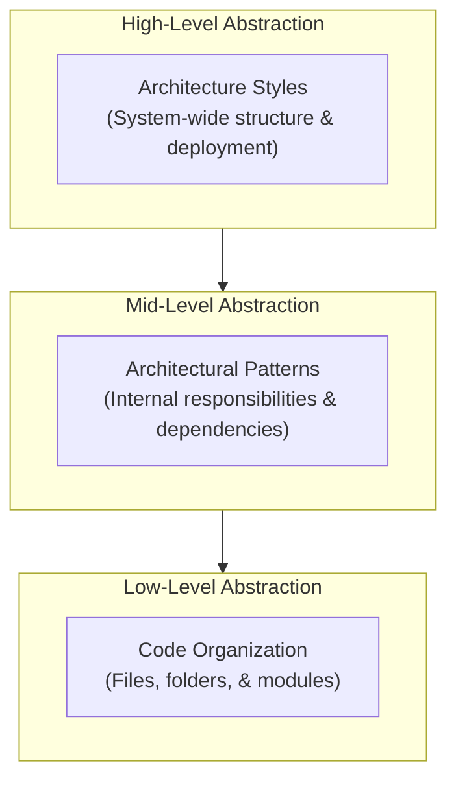

# Clean classification: architecture styles, architectural patterns, and code organization

Being strict here helps because these terms often get mixed together in class notes, blog posts, and even some professional discussions. A useful distinction is this:

- **Architectural styles** describe the **high-level organization of a software system**, including its major elements, their relationships, and the principles that shape how they interact. They may also suggest typical communication structures and, in some cases, deployment tendencies.

- **Architectural patterns** describe **reusable solutions to recurring architectural design problems**. They often define how responsibilities, boundaries, and dependencies should be organized inside a system. For example, Clean Architecture, Onion Architecture, and Hexagonal Architecture emphasize separating business rules from infrastructure concerns.

- **Code organization** describes how **source files, modules, folders, packages, or namespaces are arranged in the codebase**. This is usually a lower-level concern than software architecture, although it should align with the intended architectural structure.

The next diagram illustrates the abstraction level difference between the three concepts:

---

# 1. Software Architecture Styles

> **Definition:** architecture styles define the large-scale organization of a software system: its major parts, the way those parts interact, and often the shape of deployment or runtime communication (Bass et al., 2021; Richards & Ford, 2020; Shaw & Garlan, 1996).

## 1. Monolithic architecture

A monolith is a system built and deployed as **one application unit**. Internally it may have many modules, but those modules are not independently deployed. This contrasts with distributed approaches in which parts of the system can be deployed separately (Bass et al., 2021; Richards & Ford, 2020).

### Typical characteristics

- Single deployable artifact
- Shared process space
- Easier operational setup at small scale
- Harder independent deployment of features or teams as the system grows (Bass et al., 2021; Sommerville, 2021)

---

## 2. Layered / n-tier architecture

This style organizes the system into **layers or tiers**, where each layer has a specific responsibility and typically depends only on the layer below it. Layered structures are among the classic ways of describing large-scale software organization (Shaw & Garlan, 1996; Sommerville, 2021).

### Typical characteristics

- Separation into presentation, business, and data-related responsibilities
- Constrained dependencies between layers
- Can be deployed as one unit or as multiple tiers depending on the system (Bass et al., 2021; Sommerville, 2021)

This is one of the terms that causes confusion because **layered** can be discussed both as:

- a **architecture style**, and
- an **architectural pattern** (Bass et al., 2021; Martin, 2017).

---

## 3. Client-server architecture

Client-server separates the system into at least two major roles:

- the **client**, which requests services and often handles user interaction
- the **server**, which provides services, data, or processing

This is one of the classic distributed architecture forms and remains foundational in software architecture literature (Shaw & Garlan, 1996; Sommerville, 2021).

### Typical characteristics

- Clear split between requesters and providers
- Common in web, desktop-networked, and mobile-backend systems
- Often the starting point for distributed systems before moving into more specialized styles (Bass et al., 2021; Sommerville, 2021)
